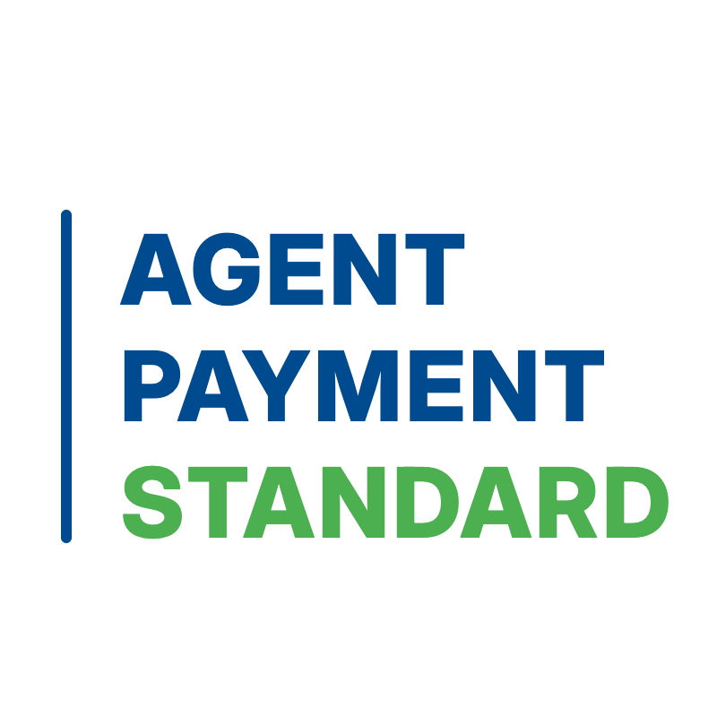

# Agent Payment Standard (APS)

  

    <h2>Building the Agent Payment Standard you can trust</h2>

---

##  Introduction

With the explosive growth of Autonomous Agents (AI Agents), payments have become a critical bottleneck hindering commercial closure. Existing payment systems are primarily designed for "humans" and lack the understanding and adaptation required for "machine decision-making and autonomous execution."

 **Agent Payment Standard (APS)** is a full-lifecycle trust governance standard for agent and machine payments. It aims to establish standards through a neutral, community-driven, and transparent approach, thereby enabling a trusted, automated, and highly compliant financial infrastructure for agent and machine payments.

 APS is not a protocol and does not prescribe specific implementations. Instead, it defines the principles, requirements, and boundaries within which systems must operate—allowing diverse protocols and implementations to innovate and interoperate freely, as long as they remain compliant with the standard.

We aspire to become the industry standard for agent payments—comparable in authority to "[PCI DSS](https://www.pcisecuritystandards.org/)", while extending beyond it in scope, adaptability, and future readiness.

## Core Components

APS encompasses the following core components:

1. **Know Your Agent (KYA)**
    - Prior to initiating any transaction, both user-side agents and merchant-side agents must undergo KYA verification. KYA is designed to be performed at the root agent level; derived or delegated agents may inherit the trust credentials, avoiding redundant verification processes.

2. **Verify Your Agent (VYA)**
    - At the point of transaction, mechanisms must be in place to verify that the interacting agent is the same entity that has successfully completed KYA, ensuring authenticity and preventing impersonation or spoofing.

3. **Transaction Presence Models**
    - Transactions are classified based on human involvement, including:
        - Human-present transactions
        - Human-absent (autonomous) transactions

4. **Interaction Modalities**
    - APS supports multiple interaction methods, including MCP-based interactions, CLI, HTTP-based interactions, and Agent-to-agent communication.

5. **Transaction Scenarios**
    - Applicable across a range of economic interactions, including B2C, Agent to Human, and Agent-to-Agent (A2A).

6. **Underlying Payment Networks**
    - APS is applicable across heterogeneous payment infrastructures, including traditional and cryptocurrency-based networks.

7. **Auditability**
    - APS requires comprehensive audit mechanisms to ensure that all agent activities and transactions are traceable, transparent, and verifiable.

8. **Review and Governance**
    - APS introduces review mechanisms to assess the legitimacy and reasonableness of autonomous payment requests initiated by agents, ensuring alignment with user intent and policy constraints.

---

[Our github repo](https://github.com/Agent-Payment-Standard){ .md-button .md-button--primary }

